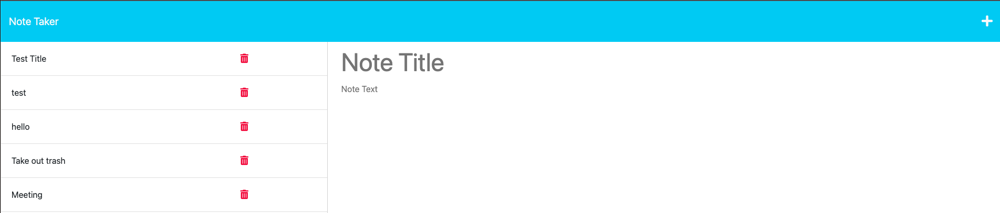

# Note_Taker

A note taking application using express.js to write and save notes.

This was created for the purpose of fulfilling the challenge requirements in module 11. Create an application called Note Taker that can be used to write and save notes. This application will use an Express.js back end and will save and retrieve note data from a JSON file.

# Installation
The user needs to install a `package.json` by entering `npm init` in their command line. Following that the user will also have to add express by using `npm i express@4.17.1` in their command line. Last the user will need to add uuid by entering `npm i uuid@8.3.2` into their command line.

```
GIVEN a note-taking application
WHEN I open the Note Taker
THEN I am presented with a landing page with a link to a notes page
WHEN I click on the link to the notes page
THEN I am presented with a page with existing notes listed in the left-hand column, plus empty fields to enter a new note title and the note’s text in the right-hand column
WHEN I enter a new note title and the note’s text
THEN a Save icon appears in the navigation at the top of the page
WHEN I click on the Save icon
THEN the new note I have entered is saved and appears in the left-hand column with the other existing notes
WHEN I click on an existing note in the list in the left-hand column
THEN that note appears in the right-hand column
WHEN I click on the Write icon in the navigation at the top of the page
THEN I am presented with empty fields to enter a new note title and the note’s text in the right-hand column
```

# Mock-up
The following images show the applications apperance



# Links

## End project
https://kylekarotko.github.io/Note_Taker/
## Github Repo
https://github.com/KyleKarotko/Note_Taker/

## Heroku link
